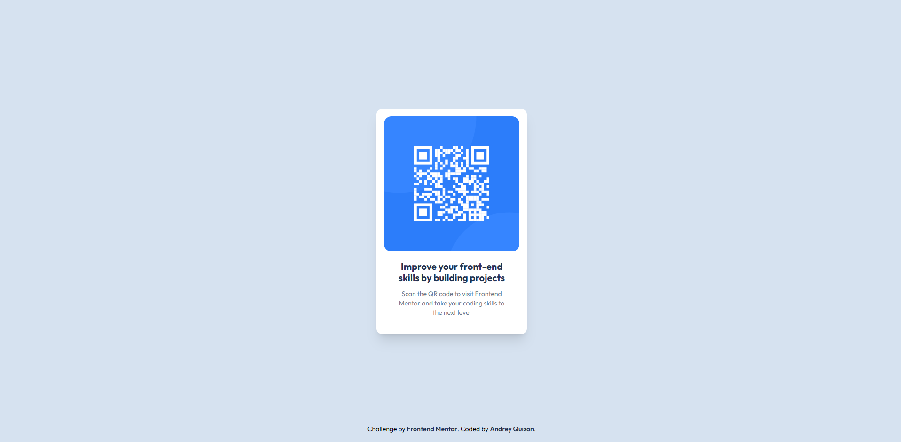

# Frontend Mentor - QR Code Component Solution

This is a solution to the [QR Code Component Challenge on Frontend Mentor](https://www.frontendmentor.io/challenges/qr-code-component-iux_sIO_H). Frontend Mentor challenges help you improve your coding skills by building realistic projects.

## Table of contents

- [Overview](#overview)
  - [Screenshot](#screenshot)
  - [Links](#links)
- [My process](#my-process)
  - [Built with](#built-with)
  - [What I learned](#what-i-learned)
  - [Continued development](#continued-development)
  - [Useful resources](#useful-resources)
- [Author](#author)

## Overview

### Screenshot




### Links

- **Solution URL:** [https://github.com/ndryqzn/qr-code-component-main](https://github.com/ndryqzn/qr-code-component-main)
- **Live Site URL:** [https://ndryqzn.github.io/qr-code-component-main//](https://ndryqzn.github.io/qr-code-component-main//)

## My process

### Built with

- Semantic HTML5 markup  
- Tailwind CSS (via CDN)  
- Mobile-first workflow  
- Flexbox  
- Custom responsive adjustments using arbitrary media queries  

### What I learned

I learned how to use **Tailwind CSS directly from a CDN** without needing a full build setup.  
This helped me understand Tailwind’s syntax better and how to use **arbitrary values** like `bg-[hsl(...)]` and **media queries** such as `[@media(max-width:320px)]` for responsiveness.

Example:
```html
<div class="[@media(max-width:320px)]:text-xs">
  Responsive text example
</div>
